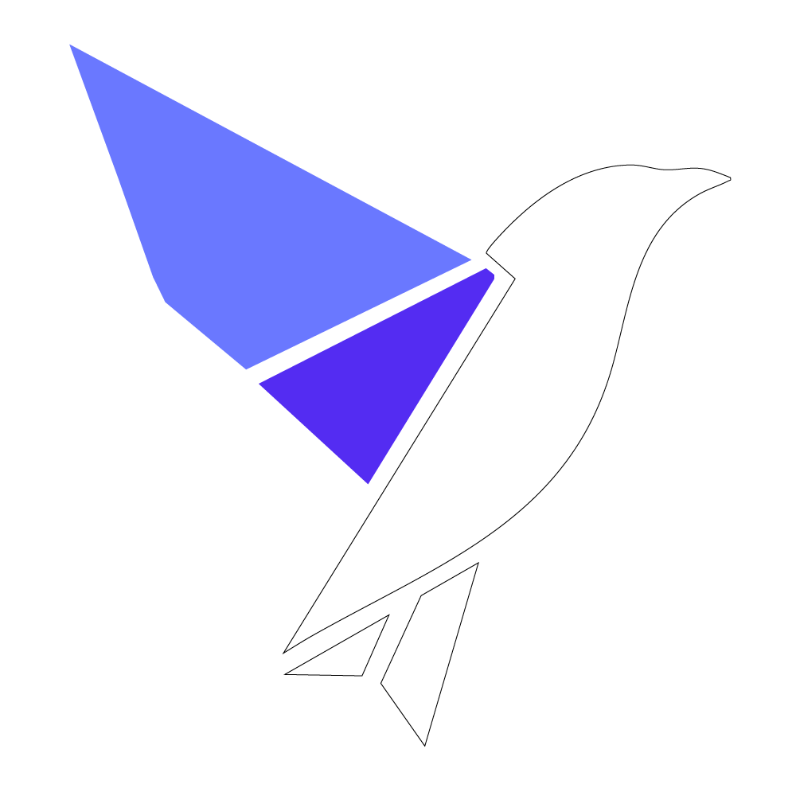

  

# Welcome to Good Omen AI Solutions

Good Omen AI Solutions is a specialized consultancy focused exclusively on the **completion, refinement, and delivery** of existing AI projects. We don’t build from scratch; we enhance, resolve, and fine-tune so you can launch.

If your AI product technically works but falls short of expectations, feels incomplete, or isn’t ready for real users, we provide the human intervention needed to move it across the finish line.

As your **Delivery Architect Partner**, we close the gap between potential and product. Our work typically includes:

- **Project Rescue & Recovery**  
  Auditing stalled or incomplete initiatives to identify and resolve the blockers preventing launch.

- **System Refinement**  
  Improving existing AI logic and workflows so the product or system reliably delivers the intended business outcome.

- **UX/UI & Aesthetic Refinement**  
  Elevating the presentation so your product looks as sophisticated as the technology inside. We ensure the look and feel is intuitive, credible, and ready for a premium market.

- **Operational Readiness**  
  Preparing products for real-world use by ensuring stability, architectural integrity, and scalability.

## We’re a good fit if you have:
1. An AI project that has stalled or lost momentum  
2. A technical implementation that doesn’t match the original vision  
3. A functional tool that isn’t yet ready for users or launch  

## Our Mission
We believe the most valuable AI is the one that actually ships. Our mission is simple: transform work-in-progress into finished, usable products.

---

### Connect with Good Omen AI Solutions

**Website:** www.goodomenai.com
**Inquiries:** solutions@goodomenai.com

---
*We believe a clear path to delivery is the only **Good Omen** a founder needs.*
